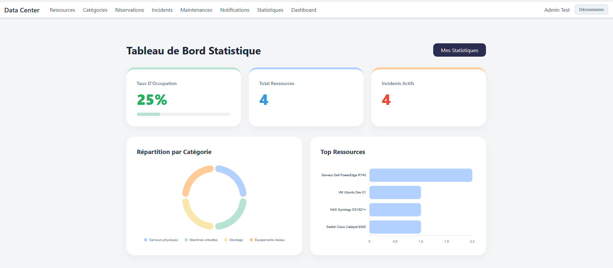
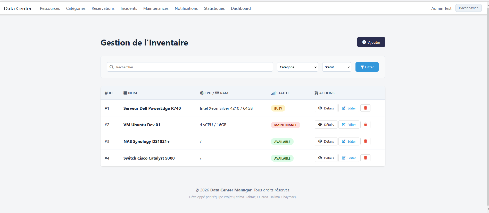
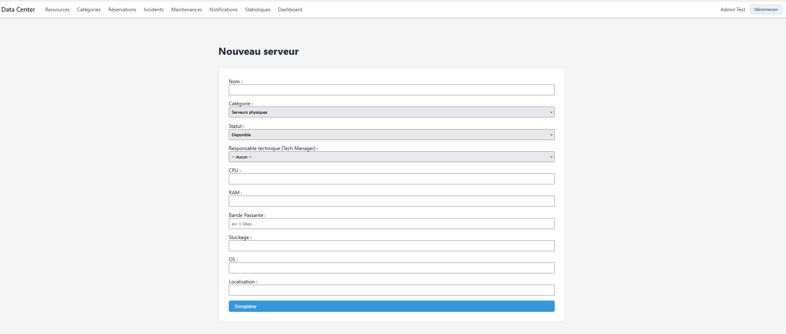

# 📊 Gestion des Ressources - Data Center Management System
R
> **Module développé par** : OUARDA  
> **Rôle** : Backend Developer & Data Analyst  
> **Période** : Janvier 2026

---

## 🎯 Vue d'ensemble

Ce module constitue **le cœur opérationnel** du système de gestion du Data Center. Il permet de gérer l'inventaire complet des équipements (serveurs, stockage, réseau) tout en fournissant des analyses en temps réel de l'infrastructure.

### Problématique résolue
Comment gérer efficacement des centaines de ressources matérielles tout en maintenant une visibilité complète sur leur état, leur utilisation et leur maintenance ?

---

## 🏗️ Architecture & Concepts

### Gestion du cycle de vie
Chaque ressource suit un flux d'états défini :
```
┌─────────────┐
│ Disponible  │ ──► Peut être réservée
└──────┬──────┘
       │
       ▼
┌─────────────┐
│   Réservée  │ ──► En cours d'utilisation
└──────┬──────┘
       │
       ▼
┌─────────────┐
│ Maintenance │ ──► Intervention technique
└──────┬──────┘
       │
       ▼
┌─────────────┐
│Hors service │ ──► Nécessite remplacement
└─────────────┘
```

### Principes de conception

|            Principe                |                   Implémentation                    |
|------------------------------------|-----------------------------------------------------|
| **Séparation des responsabilités** | Controllers dédiés par fonctionnalité               |
| **Traçabilité**                    | Logs automatiques de toutes les actions             |
| **Performance**                    | Eager loading + pagination pour requêtes optimisées |
| **Évolutivité**                    | Architecture modulaire (Catégories extensibles)     |

---

## 🚀 Fonctionnalités principales

### 📦 Gestion des ressources

- ✅ **CRUD Complet** : Création, lecture, modification, suppression sécurisée
- 🔍 **Recherche avancée** : Filtres par nom, catégorie, statut...
- 🏷️ **Catégorisation flexible** : Organisation par types d'équipements
- 📊 **Vue publique** : Catalogue consultable sans authentification

### 🛠️ Maintenance & Incidents

- ⚠️ **Signalement d'incidents** : Reporting rapide avec niveaux de gravité
- 📅 **Planification de maintenance** : Calendrier des interventions
- 🔔 **Détection de conflits** : Alerte si maintenance pendant réservation
- 📈 **Historique complet** : Traçabilité de toutes les interventions

### 📊 Analytics & Statistiques

- 📉 **Taux d'occupation** : Visualisation en temps réel
- 🥧 **Répartition par statut** : Graphiques interactifs (Chart.js)
- 📊 **Top ressources** : Classement par taux d'utilisation
- 📈 **Tendances** : Évolution sur 6 mois
- 🎯 **KPIs personnalisés** : Métriques par utilisateur

---

## 🎨 Interfaces développées

### Pages créées
```
resources/
├── 📄 public-index.blade.php    → Catalogue public
├── 📋 index.blade.php           → Liste admin avec filtres
├── ➕ create.blade.php          → Formulaire création
├── ✏️ edit.blade.php            → Formulaire édition
└── 👁️ show.blade.php            → Fiche détaillée

categories/
├── 📋 index.blade.php           → Gestion catégories
├── ➕ create.blade.php          
└── ✏️ edit.blade.php            

incidents/
├── 📋 index.blade.php           → Liste incidents (Tech)
├── ⚠️ create.blade.php          → Signaler incident (Users)
└── 📝 show.blade.php            → Détails & résolution

statistics/
├── 📊 index.blade.php           → Dashboard analytics
└── 📈 my-resources.blade.php    → Stats personnelles
```

### Exemples visuels

#### Tableau de bord statistiques


*Visualisation en temps réel avec 4 graphiques interactifs*

---


## 📁 Structure du code
```
app/
├── Http/Controllers/
│   ├── ResourceController.php          (CRUD + Filtres)
│   ├── CategoryController.php          (Gestion catégories)
│   ├── IncidentController.php          (Signalement + Résolution)
│   ├── MaintenanceController.php       (Planification)
│   └── StatisticsController.php        (Analytics)
│
├── Services/
│   └── ResourceStatisticsService.php   (Calculs métiers)
│
└── Http/Requests/
    └── ResourceRequest.php             (Validation)

resources/views/
├── resources/      (5 vues)
├── categories/     (3 vues)
├── incidents/      (3 vues)
├── maintenances/   (2 vues)
└── statistics/     (2 vues)

public/
├── css/
│   ├── resources.css       (Styles composants)
│   └── statistics.css      (Styles graphiques)
└── js/
    └── statistics.js       (Génération charts)

routes/
└── resources.php           (25+ routes)
```

---

## 🔐 Sécurité & Permissions

### Niveaux d'accès

| Rôle                | Consultation | Création | Modification | Suppression |
|---------------------|--------------|----------|--------------|-------------|
| 👤 **Invité**       | ✅ Public   |    ❌    |      ❌      |     ❌     |
| 👤 **User**         | ✅ Toutes   |    ❌    |      ❌      |     ❌     |
| 🔧 **Tech Manager** | ✅ Toutes   |    ✅    |      ✅      |     ❌     |
| 👑 **Admin**        | ✅ Toutes   |    ✅    |      ✅      |     ✅     |

### Mesures implémentées

- 🛡️ **CSRF Protection** : Tokens sur tous les formulaires
- ✅ **Validation stricte** : Form Requests avec règles métier
- 🔒 **Policies Laravel** : Autorisations granulaires
- 📝 **Activity Logs** : Traçabilité des actions sensibles

---


## 🎓 Compétences développées

### Techniques
- ✅ Maîtrise avancée de Laravel (Eloquent, Blade, Routing)
- ✅ Optimisation de requêtes SQL (N+1 queries, Eager Loading)
- ✅ Intégration de librairies JavaScript (Chart.js)
- ✅ Design responsive sans framework CSS

### Transversales
- 🤝 Travail en équipe (coordination avec 4 développeurs)
- 📅 Gestion de projet (respect du planning sur 8 jours)
- 🐛 Résolution de problèmes (OpenSSL, Git conflicts)

---

### Commandes essentielles
```bash
# Installer les dépendances
composer install

# Lancer les migrations
php artisan migrate --seed

# Démarrer le serveur
php artisan serve

# Accéder au module
http://localhost:8000/resources
```
---

## 📸 Galerie

<details>
<summary>📷 Voir les captures d'écran</summary>

### Interface principale


### Formulaire de création


### Dashboard statistiques


### Gestion incidents


</details>

---

## 📞 Contact & Support

**Développeuse :** OUARDA  
**Email :** ouardaaitelfakih@gmail.com  
**GitHub :** [@ouarda](github.com/ouarda-aitelfakih)  
**LinkedIn :** [Profil OUARDA](linkedin.com/in/ouarda-ait-el-fakih-b7a534296/)

---

## 📄 Licence

Ce projet est développé dans le cadre d'un projet académique.  
© 2026 Data Center Management Team

---

<div align="center">

**🌟 Fait avec passion et rigueur par OUARDA 🌟**

*"Transformer la complexité technique en solutions élégantes"*

[](https://laravel.com)
[](https://php.net)
[](https://chartjs.org)

</div>